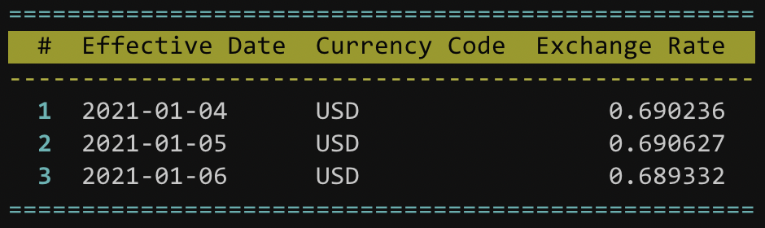

# t2

Utility for text tables.

[](https://search.maven.org/search?q=g:%22com.github.losizm%22%20AND%20a:%22t2_3%22)

## Getting Started
To get started, add **t2** to your project:

```scala
libraryDependencies += "com.github.losizm" %% "t2" % "2.0.0"
```

_**NOTE**: Starting with version 1.0, **t2** is written for Scala 3. See
previous releases for compatibility with Scala 2.12 and 2.13._

### Usage

Below is an example of **t2** in action. Here it builds a table and writes the
content to stdout.

```scala
// Build table with first row as table header
val table = t2.TableBuilder()
  .add("#", "Effective Date", "Currency Code", "Exchange Rate")
  .add("1", "2021-01-04", "USD", "0.690236")
  .add("2", "2021-01-05", "USD", "0.690627")
  .add("3", "2021-01-06", "USD", "0.689332")
  .build()

// Create table writer with supplied configuration
val writer = t2.TableWriter(
  "ansiColorEnabled" -> "true",
  "tableBorderColor" -> "cyan",
  "tableHeaderColor" -> "black,yellowBackground",
  "bodyRuleColor"    -> "yellow",
  "rowHeaderEnabled" -> "true",
  "rowHeaderColor"   -> "bold,cyan",
  "columnRightAlign" -> "0,3" // Right align first and last columns
)

// Write table to stdout
writer.write(System.out, table)
```

The generated output would look something like the following if printed to a
color-enabled terminal:

<div style="background: #111">
  
</div>

## API Documentation

See [scaladoc](https://losizm.github.io/t2/latest/api/t2.html)
for additional details.

## License
**t2** is licensed under the Apache License, Version 2. See [LICENSE](LICENSE)
for more information.
